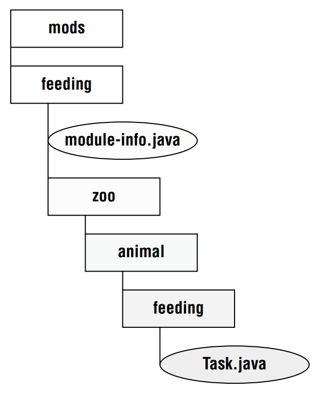
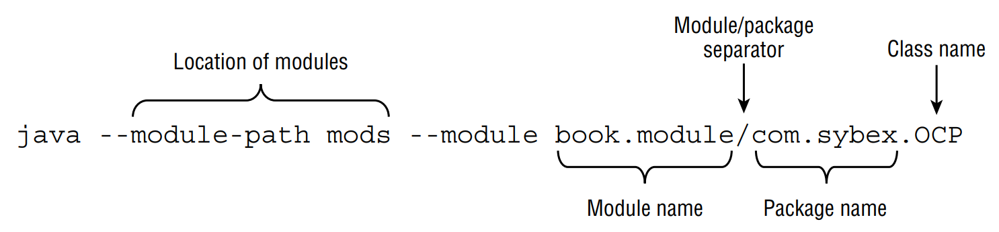

# Creating and Running a Modular Program

## I. Creating the Files
```java
package zoo.animal.feeding;

public class Task {
    public static void main(String... args) {
        System.out.println("All fed!");
    }
}
```
&emsp;&emsp;
Next comes the *module-info.java* file. This is the simplest possible one:
```java
module zoo.animal.feeding {
    
}
```
> *Figure 12.4* Module zoo.animal.feeding directory structure



&emsp;&emsp;
The directory mods is to store the module artifacts. The directory can be named anything, but mods is a common name.

## II. Compiling Our First Module

Before we can run modular code, we need to compile it. Other than the module-path option.
```java
javac --module-path mod 
        -d feeding
        feeding/zoo/animal/feeding/*.java feeding/module-info.java
```

As a review, the -d option specifies the directory to place the class files in. The end of the command is a list of the .java files 
to compile. You can list the files individually or use a wildcard for all .java files in a subdirectory.

&emsp;&emsp;
The new part is module-path. This option indicates the location of any custom module files, In this example, module-path could have been 
omitted since there are no dependencies. You can think of module-path as replacing the classpath option when you are working on a 
modular program.

> *What about the classpath?**
> The *classpath* option has three possible forms: *-cp*, *--class-path*, and *-classpath.* You can still these options, In fact, it is 
> common to do so when writing nonmodular programs.

Just like classpath, you can use an abbreviation in the command. The syntax *--module-path* and *-p* are equivalent. That means we could have 
written many other commands in place of the previous command. The following four command show the *-p* option:
```java
javac -p mods -d feeding
    feeding/zoo/animal/feeding/*.java   feeding/*.java

javac -p mods -d feeding
    feeding/zoo/animal/feeding/*.java   feeding/module-info.java
    
 javac -p mods -d feeding
    feeding/zoo/animal/feeding/Task.java    feeding/module-info.java
    
 javac -p mods -d feeding
    feeding/zoo/animal/feeding/Task.java    feeding/*.java
```

> *Table 12.1* Options you need to know for using modules with *javac*
>
> | Use for                   | Abbreviation | Long form     |
> |:--------------------------|:------------:|:--------------|
> | Directory for class files |     -d       | n/a           |
> | Module path               |      -p      | --module-path |

## III. Running Our First Module

> *Figure 12.5* Running a module using java



```java
java --module-path feeding
    --module zoo.animal.feeding/zoo.animal.feeding.Task
```

The following code is equivalent to previous code
```java
java -p feeding
    -m zoo.animal.feeding/zoo.animal.feeding.Task
```

> *Table 12.2* Options you need to know for using modules with *java*

| Use for     | Abbreviation | Long form     |
|:------------|:------------:|:--------------|
| Module name |      -m      | --module      |
| Module path |      -p      | --module-path |